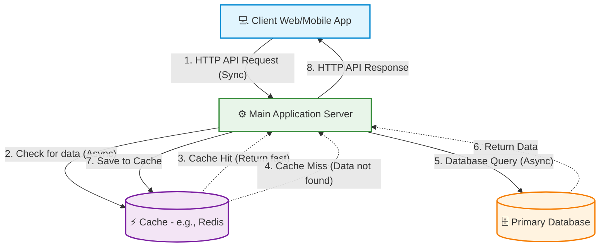

# Week 4 Architecture Diagram

```mermaid
graph TD
    %% Styling
    classDef client fill:#e1f5fe,stroke:#0288d1,stroke-width:2px;
    classDef server fill:#e8f5e9,stroke:#388e3c,stroke-width:2px;
    classDef db fill:#fff3e0,stroke:#f57c00,stroke-width:2px;
    classDef cache fill:#f3e5f5,stroke:#7b1fa2,stroke-width:2px;

    %% Components
    Client[💻 Client Web/Mobile App]:::client
    Server[⚙️ Main Application Server]:::server
    Cache[(⚡ Cache - e.g., Redis)]:::cache
    DB[(🗄️ Primary Database)]:::db

    %% Request/Response Flow
    Client -- "1. HTTP API Request (Sync)" --> Server
    
    Server -- "2. Check for data (Async)" --> Cache
    Cache -. "3. Cache Hit (Return fast)" .-> Server
    Cache -. "4. Cache Miss (Data not found)" .-> Server
    
    Server -- "5. Database Query (Async)" --> DB
    DB -. "6. Return Data" .-> Server
    
    Server -- "7. Save to Cache" --> Cache
    Server -- "8. HTTP API Response" --> Client
```