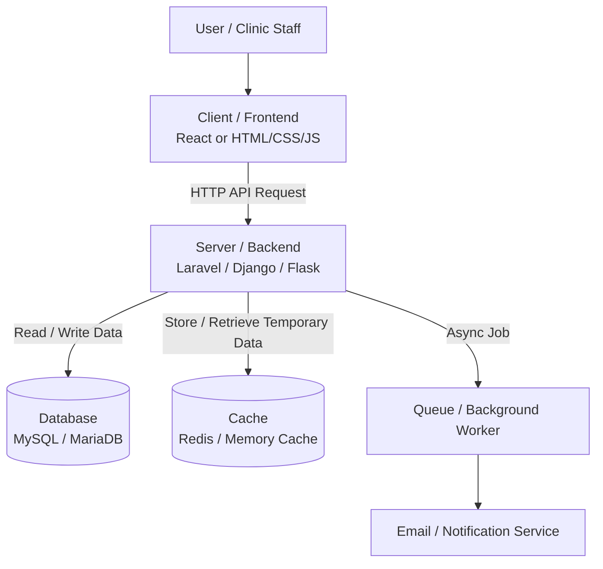

# Week 4 Architecture Diagram

## Explanation

This diagram represents a simple monolithic web application architecture.

The client is the user-facing part of the system. It sends HTTP API requests to the backend server.

The backend server handles authentication, validation, business logic, and communication with the database.

The database stores the permanent source of truth, such as users, patients, appointments, and payments.

The cache stores temporary frequently used data to improve performance and reduce database load.

For slow tasks, such as sending confirmation emails, the backend can use a queue and background worker so the user does not have to wait for the task to finish.