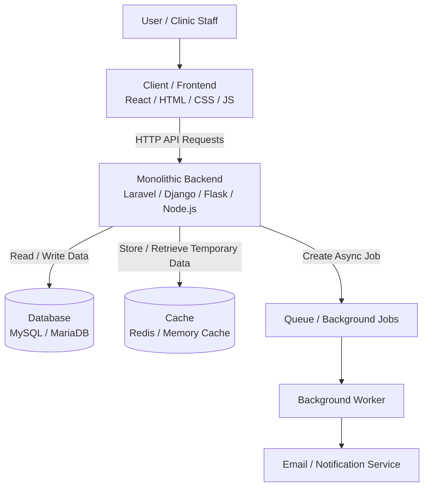
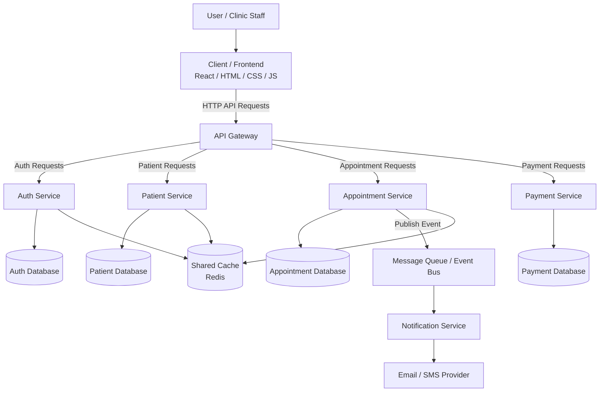

# Week 4 Architecture Diagrams

This document contains two architecture diagrams:

1. Monolithic architecture
2. Distributed system architecture

The example used is a dental clinic web application, but the same ideas apply to many full-stack applications.

---

# 1. Monolithic Architecture

A monolithic architecture means the main backend logic is inside one application.

In this example, the frontend talks to one backend server. That backend handles authentication, validation, business logic, database interaction, caching, and background jobs.



## Explanation

This diagram represents a simple monolithic web application.

The client is the user-facing part of the system. It sends HTTP API requests to the backend.

The backend is one main application that handles the core logic of the system. It manages authentication, validation, business rules, API endpoints, database communication, cache usage, and background jobs.

The database stores the permanent source of truth, such as users, patients, dentists, appointments, treatments, and payments.

The cache stores temporary frequently used data, such as sessions, dashboard data, or repeated query results. This helps the application respond faster and reduces database load.

The queue and background worker are used for asynchronous tasks, such as sending appointment confirmation emails. This means the user does not need to wait for the email to be sent before getting a response.

## Example Request Flow

Example: Booking an appointment

1. The receptionist fills out an appointment form in the frontend.
2. The frontend sends a POST request to the backend API.
3. The backend validates the request.
4. The backend checks if the dentist is available.
5. The backend saves the appointment in the database.
6. The backend clears or updates cached appointment data if needed.
7. The backend returns a success response to the frontend.
8. The frontend shows a confirmation message.
9. A background worker may send a confirmation email asynchronously.

## Key Point

This is still a monolith because the main business logic is inside one backend application.

The system can still use a database, cache, queue, and external email service, but the main backend is not split into multiple independent services.

---

# 2. Distributed System Architecture

A distributed system means the application is split into multiple independent services.

Each service is responsible for a specific part of the system. These services communicate with each other through APIs, queues, or events.



## Explanation

This diagram represents a distributed system.

Instead of one backend application handling everything, the system is split into multiple services.

The API Gateway is the entry point for client requests. It routes requests to the correct service.

The Auth Service handles login, registration, roles, and permissions.

The Patient Service handles patient records and medical information.

The Appointment Service handles appointment booking, dentist schedules, and availability.

The Payment Service handles invoices and payments.

The Notification Service handles emails, SMS messages, and reminders.

Each service may have its own database. This allows services to be more independent, but it also makes the system more complex.

The message queue or event bus is used for asynchronous communication between services. For example, when an appointment is booked, the Appointment Service can publish an event, and the Notification Service can send a reminder later.

## Example Request Flow

Example: Booking an appointment

1. The receptionist fills out an appointment form in the frontend.
2. The frontend sends a POST request to the API Gateway.
3. The API Gateway routes the request to the Appointment Service.
4. The Appointment Service checks appointment availability.
5. The Appointment Service saves the appointment in its database.
6. The Appointment Service publishes an event saying that an appointment was created.
7. The Notification Service receives the event.
8. The Notification Service sends an email or SMS reminder.
9. The Appointment Service returns a response through the API Gateway.
10. The frontend shows a confirmation message.

## Key Point

This is distributed because the backend is split into multiple independent services.

Each service has its own responsibility and may have its own database. This can help with scaling and team organization, but it also makes deployment, debugging, communication, and data consistency more difficult.

---

# 3. Monolith vs Distributed System

| Topic | Monolith | Distributed System |
|---|---|---|
| Backend structure | One main backend application | Multiple independent services |
| Complexity | Lower | Higher |
| Deployment | Deploy one backend | Deploy many services |
| Communication | Internal function calls | Network calls, APIs, events, queues |
| Database | Usually one shared database | Often separate databases per service |
| Scaling | Scale the whole backend | Scale services independently |
| Debugging | Easier | Harder |
| Best for | Small/medium apps, MVPs, internship projects | Large systems, big teams, high traffic |
| Example | One Laravel app for a dental clinic | Separate Auth, Patient, Appointment, Payment, and Notification services |

---

# 4. Final Summary

A monolith is usually the best starting point for small or medium applications because it is simpler to build, test, deploy, and understand.

A distributed system is useful when an application becomes large enough that different parts need to scale independently or be managed by separate teams.

For most internship-level projects, a clean monolith or modular monolith is the best choice.

Simple rule:

```text
Start with a monolith.
Organize it well.
Move to distributed services only when there is a real need.
```